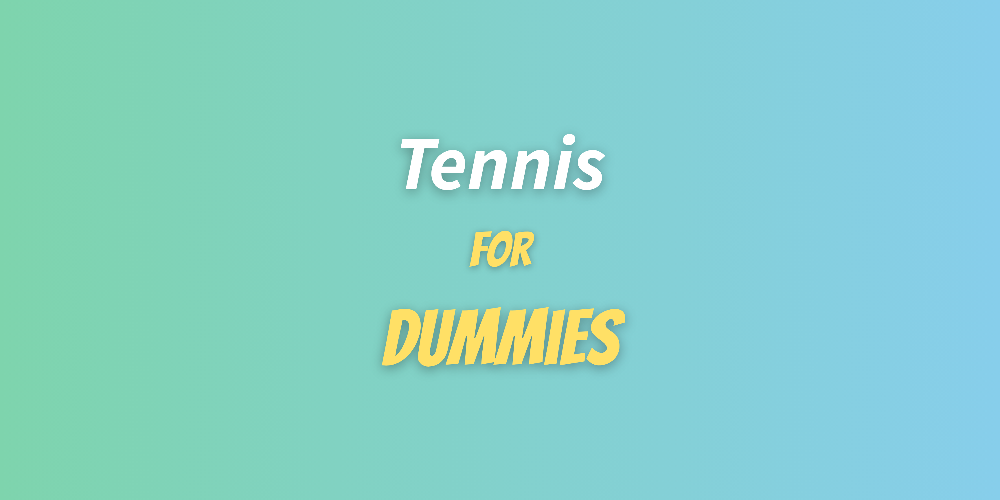

# Project of Data Visualization (COM-480)

| Student's name    | SCIPER |
|-------------------|--------|
| Charlotte Meyer   | 315568 |
| Charlotte Sacré   | 357798 |
| Jérémie De Faveri | 287454 |


<p align="center">

<p>
<!--
<div style="background: linear-gradient(to right, #7ED4AD, #87CEEB); padding: 20px; border-radius: 10px; text-align: center;">
  <span style="font-family: 'Source Sans Pro', italic; color: white; font-size: 2em;">Tennis</span><br>
  <span style="font-family: 'Bangers', cursive; color: #FFE066; font-size: 2em;"> for</span><br>
  <span style="font-family: 'Bangers', cursive; color: #FFE066; font-size: 2em;"> Dummies</span>
</div>
<link href="https://fonts.googleapis.com/css2?family=Bangers&family=Source+Sans+Pro:ital,wght@1,700&display=swap" rel="stylesheet">
-->

:green_book: Check out how our design decisions and how we reached our final website in our [Process Book](./processbook.pdf)! \
:movie_camera: Check out our website's different functionalities in our [Screen Cast](./ScreenCast.MOV)! \
:sparkles: Or simply have fun on the [deployed website](https://com-480-data-visualization.github.io/band_data/)!

If you're using firefox please make sure you are on version 138 or later when visiting our website.

## :dart: Goal
### :tennis: What Is It?
Tennis For Dummies is an interactive website that aims to provide an introduction to the world of tennis while also engaging hardcode tennis fans by offering deep insights into players' performance and key statistics. 

### :tennis: Why?
Tennis is one of the world's most popular sports and boasts an incredible roster of legends, from Billie Jean King to Rafael Nadal. However, for people new to the sport, understanding the rules and intricacies of the sport may be overwhelming,
and most resources available today directly dive into complex data targeted to a knowledgeable audience. We aim to bridge this gap by first providing foundational knowledge about the world of tennis such that our users feel confident in understanding 
historical trends, match-level insights, and technical aspects of player performances. To provide deep insights for seasoned fans, we also create detailed player profiles that capture the essence of distinct playing styles across time, tournaments, and court surfaces. 

Ultimately, whether you want to learn more the point system or delve into Roger Federer's performance, we've got you covered with our data-rich and user-friendly visualizations!


## :floppy_disk: Data

For our datasets, we use Jeff Sackmann’s extensive data files on players, historical rankings, and tennis matches from the [Association of Tennis Professionals (ATP)](https://github.com/JeffSackmann/tennis_atp) and [Women's Tennis Association (WTA)](https://github.com/JeffSackmann/tennis_wta), from 1991 onwards.

## :globe_with_meridians: Installation & Usage


To run our website locally or make contributions, first clone the repository: 
```bash
git clone git@github.com:com-480-data-visualization/band_data.git
cd band_data
```

The repository structure is as follows: 
```
.
├── README.md
├── processbook.pdf             Process Book
├── analysis                    Data Processing & Init Analysis scripts
├── data                        Processed data files
├── docs                        Website files
│     ├── assets                    Assets directory 
│     │     ├── cursor                  Cursor images
│     │     ├── graphs                  Initial sketches 
│     │     └── icons                   Icon images
│     ├── components                HTML subpages
│     ├── css                       Styling file
│     ├── data                      Data files for website
│     ├── js                        JS scripts 
│     ├── index.html                Homepage
│     └── player-profile.html       Player profile page
└── milestones                 Previous milestones
```

Then, you can easily render the website with an HTTP server!
```bash 
cd docs
python -m http.server <optional port>
```

If you're using firefox please make sure you are on version 138 or later.

## :checkered_flag: Previous Milestones

The previous milestones can be found here: [Milestone 1](./milestones/milestone1.md) and [Milestone 2](./milestones/milestone2.pdf). 


