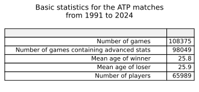
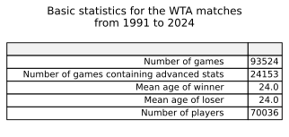
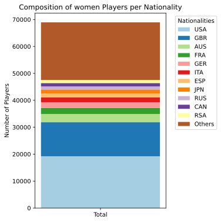
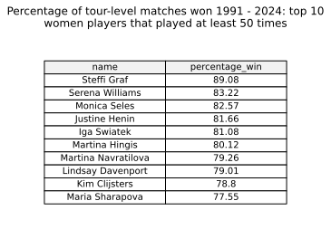

# Project of Data Visualization (COM-480)

| Student's name    | SCIPER |
|-------------------|--------|
| Charlotte Meyer   | 315568 |
| Charlotte Sacré   | 357798 |
| Jérémie De Faveri |  |

[Milestone 1](#milestone-1) • [Milestone 2](#milestone-2) • [Milestone 3](#milestone-3)

## Milestone 1 (21st March, 5pm)

**10% of the final grade**

This is a preliminary milestone to let you set up goals for your final project and assess the feasibility of your ideas.
Please, fill the following sections about your project.

*(max. 2000 characters per section)*

### Dataset

For our datasets, we use Jeff Sackmann’s extensive data files on players, historical rankings, and tennis matches from the Association of Tennis Professionals (ATP) and Women’s Tennis Association (WTA). The data files for both associations follow the same format and have identical columns. In addition, both associations provide a supplemental player file with additional information on the players. This standardized formatting of both datasets allows for easy integration of the data.  

Both datasets contain extensive data on matches starting form 1968. This includes but is not limited to tournament name, court surface, and number of sets. Files from 1991 onwards additionally include statistics about the opposing players e.g., the number of aces or serve points each player scores. For consistency, we will restrict our analyses to those matches. 

Unfortunately, the data is split into one file for every year - otherwise the data would be too large to fit on GitHub. Our first step will be to combine all the files starting from 1991 for simpler processing. Otherwise, these files were created for easy use and do not require much cleaning and preprocessing apart from removing rows and cells with missing information.  

Datasets: 
- ATP data: [https://github.com/JeffSackmann/tennis_atp](https://github.com/JeffSackmann/tennis_atp) with files of interest being `atp_matches_YYYY.csv` , `atp_players.csv`, and `atp_rankings_*.csv`
- WTA data: [https://github.com/JeffSackmann/tennis_wta](https://github.com/JeffSackmann/tennis_wta) with files of interest being `wta_matches_YYYY.csv` , `wta_players.csv`, and `wta_rankings_*.csv`

### Problematic

Our project aims to create an interactive tennis visualization that explores player performance, match-level insights, and historical trends. By visualizing the rich history and complexity of tennis data, we want to engage both people new to the sport and hardcore tennis fans with a user-friendly yet data-rich platform. The goal is to make complex statistics and patterns more accessible while offering deep insights for seasoned fans. 

Indeed, we first want to introduce newcomers to key features match winners—such as serve efficiency, types of scored points, or physical attributes—across different tournaments, surfaces, and players. For more advanced fans, we aim to create detailed player profiles that capture the essence of distinct playing styles. By leveraging historical ATP and WTA data, we seek to uncover trends in player performance, explore which features influence match outcomes, and identify the statistical hallmarks of successful players such as the legendary Serena Williams and Roger Federer. 

Finally, we want to show that beyond strategy and impressive physical performances, some of the sport’s biggest names, like Billie Jean King, have not only shaped the game but also left a lasting impact on society and global sports culture. Ultimately, our project aims to highlight these historical shifts and player milestones while uncovering the tactical and statistical nuances that define tennis greatness.

### Exploratory Data Analysis

We explored the ATP and WTA datasets using the [following](./analysis/analysis.py) python script, restricting overselves to tour-level matches past 1991 (see [the dataset section](#dataset) for more information).

#### Basic statistics

It's interesting to note here that while most matches past 1991 have advanced stats for the ATP dataset, this is not the case for the WTA dataset. This is because for the WTA dataset, advanced statistics are actually only available from 2015 onwards.

#### Nationalities

#### Players with the highest percentage of winning games

### Related work

- What others have already done with the data?
- Why is your approach original?
- What source of inspiration do you take? Visualizations that you found on other websites or magazines (might be unrelated to your data).

There exists many websites to check ATP or WTA match and player statistics, but many of them are focused on the recent or future matches, display information in a tabular format or make it difficult for new tennis fans to learn anything meaningful (e.g. [TennisRatio](https://www.tennisratio.com/#data-analysis)).

Our goal is to these statistics understandable at a glance and interesting for all - from amateurs to aficionados! 

There are many types of visualizations that would allow us to provide a global overview of different player characteristics such as parallel coordinates plots, sankey diagrams, or chord diagrams as shown in the following inspirations: 

- [Tennis Visuals](https://tennisvisuals.com/)
- [Visualizing Tennis Grand Slam Winners Performances](https://datascienceplus.com/visualizing-tennis-grand-slam-winners-performances/)
- [Tennis data visualization](https://ingilevichv.github.io/tennis/index.html)

To convey more detailed information about the technical aspects of the sport such as particular player statistics, instead of having simple tables, we aim to build player profiles similar to:
- [Rafael Nadal Profile](https://public.tableau.com/app/profile/paul1904/viz/TheReignoftheKingofClay/TheReignoftheKingofClay3)
- [Roger Federer Profile](https://www.rocketsource.com/blog/the-gift-of-roger-federer-to-corporate-america/)

## Milestone 2 (18th April, 5pm)

**10% of the final grade**

## Milestone 3 (30th May, 5pm)

**80% of the final grade**

## Late policy

- < 24h: 80% of the grade for the milestone
- < 48h: 70% of the grade for the milestone

